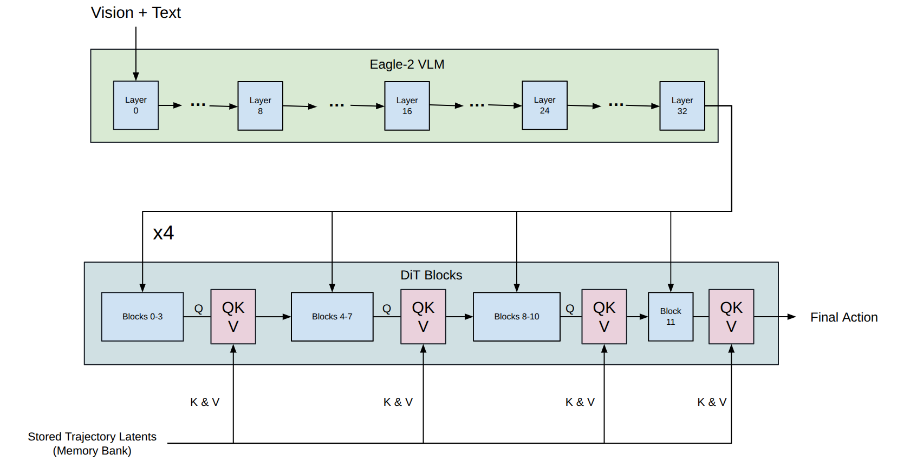
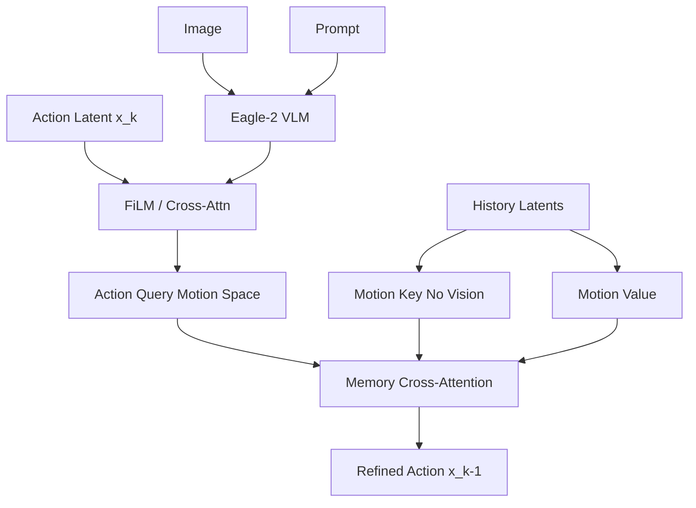

# Design Doc: Asymmetric Latent Memory for Long-Horizon Robotic Control (Rev. 2)

| **Project** | Eagle-2 + DiT Policy with History |
| :--- | :--- |
| **Author** | Haoran Yuan |
| **Date** | 2025-12-15 |
| **Status** | **Revised / Active (Aligned with current impl)** |

## 1. Abstract

This document proposes a **Latent Sliding Window Memory** architecture designed to resolve "Dead Loop" (repetitive failure) and "Perceptual Aliasing" issues in long-horizon robotic tasks.

The core innovation lies in two asymmetric designs:

1.  **Asymmetric Attention Keys:** We strictly exclude **Visual** information from the Memory Keys, relying solely on **Proprioceptive (Motion)** and **Semantic (Text)** history.
2.  **Action-Driven Retrieval:** The **vision-conditioned DiT Action Latent** is the Query (motion-to-motion matching), leveraging diffusion stochasticity to break dead loops.

-----



## 2. Core Philosophy: The Gymnast Analogy (Revised)

To explain why we use the **Action Latent** as the Query and exclude vision from the Key:

Consider a gymnast attempting a backflip on a balance beam. She slips (fails). She prepares for the second attempt.

1.  **The Trap of Visual Memory:**
    The visual scene (beam, lights) is identical to the failed attempt. If she queries her memory based on "what I see," she will retrieve the same failed motor plan. This is a **Dead Loop**.
2.  **The Correction (The Query):**
    Instead, she mentally rehearses the *next* move: "I am about to jump, but higher this time." This mental rehearsal (Current Action Hypothesis) is the **Query**.
3.  **The Muscle Memory (The Key/Value):**
    She compares this mental plan against her history: "Last time I engaged these muscles (Key), I slipped (Value)." She uses this proprioceptive history to adjust her current plan *before* execution.

**System Mapping:**

  * **Eyes (Conditioning)** $\rightarrow$ **Eagle-2 VLM**: Sets the broad context, but does not drive retrieval directly.
  * **Mental Plan (Query)** $\rightarrow$ **DiT Action Latent**: The current, evolving hypothesis of motion.
  * **Muscle History (Key/Value)** $\rightarrow$ **Trajectory Latent**: Pure motion history (Proprioception).

-----

## 3. System Architecture

### 3.1 Components

  * **Backbone:** Eagle-2 VLM (Vision/Text Injector) + DiT (Diffusion Transformer Policy).
  * **Memory Unit:** **Trajectory Latent**. A compressed vector ($1 \times D$) representing a chunk of 16 raw action steps.
  * **Memory Bank:** FIFO over $32$ trajectory latents (each = 16 raw actions) covering $32\times16=512$ steps.

### 3.2 Data Flow Diagram



-----

## 4. Detailed Design

### 4.1 Memory Representation

  * **Content:** Compressed Latent of 16 actions.
  * **Dimensionality:** $1 \times L_{dim}$ (matches DiT hidden size).

### 4.2 Asymmetric Attention Mechanism (Critical Update)

We employ a "Hybrid Injection" strategy: Vision conditions the latent first, then the latent queries the memory.

$$
\text{Attention}(Q, K, V) = \text{Softmax}\left(\frac{Q K^T}{\sqrt{d}}\right) V
$$

  * **Query (Current Action Hypothesis):**
    
$$Q = \text{DiT Latent}_{\text{curr}} \quad (\text{conditioned on } \text{Visual}_{\text{feat}})$$

    > *Rationale:* **Homogeneous Matching.** We match "Current Motion Intent" against "Past Motion History."
    > *Benefit:* Since DiT generation is stochastic (starts from random noise), $Q$ is slightly different even for identical images. This variation allows the model to retrieve different history and **break dead loops**.

  * **Key (History Index - NO VISION):**
    
$$K = \text{Trajectory Latent}_{\text{hist}} + \text{Fixed PE} + \text{Text Emb}$$

    > *Rationale:* "At that stage (PE) of that task (Text), what motion did I perform?"
    > *Function:* **Text** acts as a semantic filter (task separation); **Motion** ensures dynamic consistency.

  * **Value (History Content - Pure Motion):**
    
$$V = \text{Trajectory Latent}_{\text{hist}} + \text{Fixed PE}$$

    > *Rationale:* The raw muscle memory used to refine the current trajectory.

### 4.3 Positional Encoding

  * **Fixed Relative Window:** Index 0 (Oldest) to 31 (Newest).
  * **Translation Invariance:** Relative order only; fits cyclic tasks.

### 4.4 Trajectory Encoder (Implemented)

  * **Dual-Stream Chunk Compressor:** Separate encoders for action and state; inputs are 16-step chunks, padded/normalized to fixed dims (action max 32, state max 64).
  * **Fusion:** Action/state latents are fused (concat + MLP) to produce `traj_latent` (shape `[1, D]`, D=DiT hidden size).
  * **Memory Element:** Each memory slot holds one fused latent per 16-step chunk.
  * **Dtype Safety:** Inputs cast to model dtype (bf16 on GPU, fp32 on CPU) before projection.
  * **Keys/Values:** Key = `traj_latent + pos_emb + text_emb(zeros)`, Value = `traj_latent + pos_emb`. Memory bank length 32 (covers 512 steps).

-----

## 5. Training & Serving Alignment (Current Impl)

### 5.1 The "Stitched" Trajectory Training

To teach the model to use memory for correction, we cannot just use perfect expert demonstrations. The training data must ideally contain **recovery behaviors**.

  * **Standard Loading:** Load continuous sequence of $T=32$ chunks.
  * **Consistency Loss:** We do not need an auxiliary loss for memory retrieval. The gradient from the DiT noise prediction loss ($\mathcal{L}_{simple}$) will naturally backpropagate through the Attention layer, teaching the model: *"To de-noise this action correctly, I must look at Step $t-1$ in the memory."*

### 5.2 Data Loader & Collate (Implemented)
  * **Memory-Augmented Dataset Wrapper:** Loads up to 512-step histories, chunked into 16-step segments to fill the memory bank.
  * **Transforms:** `GR00TTransform` handles resize/crop/normalize and padding of action/state to fixed dims; dtype casting handled later in the compressor.
  * **Masks & Fallbacks:** Collate sets masks; if a modality becomes all-zero (demo edge cases), raw action/state are injected as fallback to avoid NaNs; state/action masks default to ones in tests.
  * **Teacher-Forcing:** Training uses GT chunks to build memory keys/values; inference updates FIFO per step/chunk.
  * **Embodiment:** `embodiment_id` maps to projector index; `libero_franka` reuses the `new_embodiment` slot (index 31).

### 5.3 Serving details (what we run now)
- **Embodiment tag mapping:** `new_embodiment` and `libero_franka` both map to projector index **31**. Checkpoints include metadata for `new_embodiment`; services should prefer `--embodiment_tag new_embodiment` unless metadata is duplicated for `libero_franka`.
- **Metadata video keys:** Use `video.image` and `video.wrist_image`. If metadata still has `image2`, replace with `wrist_image` (e.g., `sed -i 's/"image2"/"wrist_image"/g' metadata.json`).
- **Checkpoint path:** For speed, copy to NVMe (e.g., `/tmp/ckpt-libero-35000`) and point server there.
- **Server (gRPC):** `scripts/run_inference_server.sh` defaults to `/tmp/ckpt-libero-35000`, `DATA_CONFIG=examples.Libero.custom_data_config:LiberoDataConfig`, `EMBODIMENT_TAG=new_embodiment`, `PORT=5556`, and sets `PYTHONPATH` to the repo.
- **Client:** `examples/Libero/eval/run_eval_client.sh` connects via HOST/PORT, runs tasks (e.g., `libero_spatial`), logs to `/tmp/logs/`.
- **Smoke tests:** `tests/test_online_client.py` (gRPC reachability), `tests/test_libero_env.py` (LIBERO deps/env creation).

-----

## 6. Implementation Snippet (Pseudo-code)

This implementation shows the **Hybrid Injection** within a DiT Block.

```python
class MemoryAwareDiTBlock(nn.Module):
    def __init__(self, dim, mem_len=32):
        super().__init__()
        # Standard DiT components
        self.norm1 = nn.LayerNorm(dim)
        self.attn = nn.MultiheadAttention(dim, num_heads=8) # Self-Attn
        
        # 1. Vision Injection (from Eagle-2)
        self.cross_attn_vision = nn.MultiheadAttention(dim, num_heads=8)
        
        # 2. Memory Retrieval (The New Component)
        self.cross_attn_memory = nn.MultiheadAttention(dim, num_heads=8)
        self.mem_pos_emb = nn.Parameter(torch.randn(1, mem_len, dim))

    def forward(self, x, vlm_feat, memory_latents, text_emb):
        """
        x:              [B, 1, Dim] (Current Noisy Action Latent)
        vlm_feat:       [B, S, Dim] (Visual Features)
        memory_latents: [B, 32, Dim] (History Queue)
        """
        
        # --- Step 1: Inject Vision (Conditioning) ---
        # Before this, x is just noise. After this, x contains "Visual Intent".
        # x becomes the "Mental Plan" from the analogy.
        x_norm = self.norm1(x)
        vision_ctx, _ = self.cross_attn_vision(query=x_norm, key=vlm_feat, value=vlm_feat)
        x = x + vision_ctx  # Residual

        # --- Step 2: Query Memory (Correction) ---
        # Now use the Visually-Conditioned Motion (x) to query History
        
        # Construct Key (Motion + Time + Text) -> NO Vision in Key
        K = memory_latents + self.mem_pos_emb + text_emb
        
        # Construct Value (Pure Motion)
        V = memory_latents + self.mem_pos_emb
        
        # Query is x itself (Homogeneous: Motion searches Motion)
        mem_ctx, _ = self.cross_attn_memory(query=x, key=K, value=V)
        
        x = x + mem_ctx # Refine action based on history
        
        # --- Step 3: FFN & Next Block ---
        x = self.ffn(x)
        return x
```

## 7. Conclusion

This revised architecture aligns the retrieval mechanism with the physics of the problem. By using the **Action Latent as the Query**, we perform retrieval in a homogeneous feature space (Motion-to-Motion), ensuring higher relevance. By relying on the stochasticity of the diffusion process, the query changes even under static visual inputs, effectively preventing "Dead Loops" caused by visual aliasing.

-----

## 8. Future Work

1. **Gated Cross-Attention** — Zero-init gate to learn when memory should influence the policy, reducing early training instability.  
2. **Adaptive Eviction** — Eviction driven by attention/reward/task signals instead of pure FIFO.  
3. **Multimodal Retrieval (Optional)** — Allow text/vision prompts as retrieval conditions while keeping Keys vision-free.  
4. **Hierarchical Long-Horizon Memory** — Short-window FIFO plus long-term summaries (e.g., EMA/summary slots) for very long sequences.  
5. **Training Improvements** — More recovery-heavy data, masking/noise regularizers, MoE experts for robustness.  
6. **Evaluation Plan** — Online Evaluation with LIBERO
